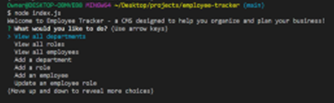
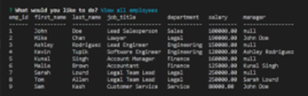
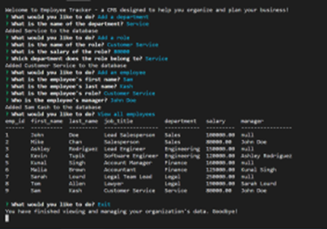
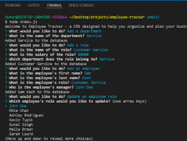

# **Employee Tracker**

## **Description**
The purpose of this project was to build a command-line application with Node.js, Inquirer, and MySQL to manage a company's employee database. This content management system allows the user to choose from a menu of options to view department, roles, and employee data; add departments, roles, and employees; and update an employee's role. The program connects on to a MySQL database on the back end so that information can be transferred to the user in the form of displayed data tables or from the user and stored into a MySQL database. 

 

## **Table of Contents**
[User Story](#user-story) 
[Acceptance Criteria](#acceptance-criteria) 
[Installation](#installation) 
[Usage](#usage) 
[License](#license) 
[Contributing](#contributing) 
[Tests](#tests) 
[Assets Utilized](#assets-utilized) 
[Built With](#built-with) 
[Walkthrough Video](#video-of-employee-tracker) 

 

### **User Story**
AS A business owner 
I WANT to be able to view and manage the departments, roles, and employees in my company 
SO THAT I can organize and plan my business 

### **Acceptance Criteria**
GIVEN a command-line application that accepts user input 
WHEN I start the application 
THEN I am presented with the following options: view all departments, view all roles, view all employees, add a department, add a role, add an employee, and update an employee role 
WHEN I choose to view all departments 
THEN I am presented with a formatted table showing department names and department ids 
WHEN I choose to view all roles 
THEN I am presented with the job title, role id, the department that role belongs to, and the salary for that role 
WHEN I choose to view all employees 
THEN I am presented with a formatted table showing employee data, including employee ids, first names, last names, job titles, departments, salaries, and managers that the employees report to 
WHEN I choose to add a department 
THEN I am prompted to enter the name of the department and that department is added to the database 
WHEN I choose to add a role 
THEN I am prompted to enter the name, salary, and department for the role and that role is added to the database 
WHEN I choose to add an employee 
THEN I am prompted to enter the employee’s first name, last name, role, and manager, and that employee is added to the database 
WHEN I choose to update an employee role 
THEN I am prompted to select an employee to update and their new role and this information is updated in the database 

 

### **Installation**
(1) Click [here](https://nodejs.org/en/) to install Node.js on your local machine if you haven't already done so. Choose the latest LTS version for the most recent stable release.  
(2) Clone this repository on your local machine. 
(3) Navigate to the repository folder. 
(4) Type the following command in the command line to download all required packages/modules.dependencies: 

    npm install

 

### **Usage**
(1) Once the installation instructions above have been completed, navigate to the folder in which the project files are stored and run the following in the command line: 

    node index.js

(2) Users will then be welcomed to the application and then asked what they would like to do:  

(3) If "View all departments", "View all roles", "View all employees", "View emmployees by manager", or "View employees by department" are chosen, then a table of the corresponding data is printed. Below is a sample of what is printed when the user chooses "View all employees": 

(4) If "Add a department", "Add a role", "Add an employee", or "Update an employee role" are chosen, then the user is provided with a series of questions that will input the corresponding data into the database. Below is a sample of the application output if a user needs to add a new department, a new role within that new department, and a new employee from that department:

Below is a sample of the application allowing for a pre-populated list of employees to choose from when updating an employee role:

 

### **License**
  This project is covered under the following license: ISC 
  https://opensource.org/licenses/ISC

 

### **Contributing**
This project does not include any contributors

 

### **Tests**
No tests were utilized in the creation of this application.

 

### **Assets Utilized** 
- schema.sql
- seeds.sql
- connection.js
- index.js

### **Built With**
* JavaScript
* Node.js
* Inquirer.js
* MySQL

 

### **Video of Employee Tracker**
